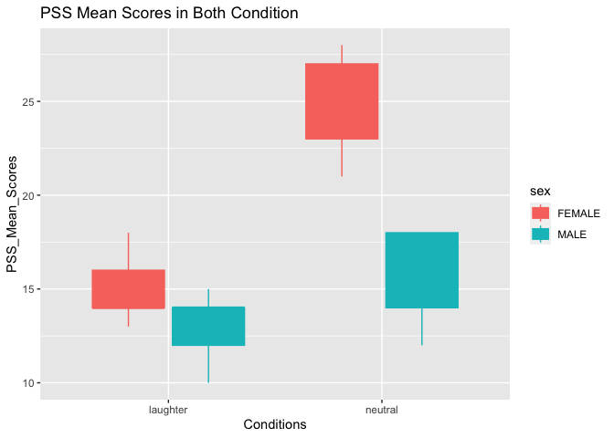

The effect of laughter on Perceived Stress
================
Konstantinos Pagonis
2022-12-21

------------------------------------------------------------------------

# Introduction

It has been believed for centuries, that laughter can be benefitial for
one’s physical and mental health. In the end of the 20th century,
scientists started providing evidence reflecting upon such claims. The
Norman Cousins case (1979), where he used laughter and positive mood
techniques in order to improve his “detoriating” health. Today, there is
an official study of laughter called “Gelotology”, and supports the
claim that laughter can reduce stress chemicals in the human body Chang
et al, 2013).A study by Eaton and Bradley (2008) that investigated
differences between genders in stress appraisal, and concluded that
females perceived the material significantly more stessful than the male
participants. However, the differences of both genders in humour
appreciation are not clear, and most studys are biased towards sex
stereotypes (Gallivan, 1999).Other studies, where participants were
exposed in humourous material, showed reduced anxiety and depression
levels(Houston et al., 2010), and even improved blood vessel
function(Miller & Fry, 2009). Overall, increasing amount of research
suggests that the use of laughter can greatly improve health in several
disorders.

- H1:There will be an effect of laughter on perceived stress
- H2: There will be an effect of gender on perceived stress.
- H3: There will be an interaction effect of laughter and gender on
  perceived stress.

# Methods

## Design

The present study is a quantitative between subjects quasi-experiment.
The effects of laughter (IV) on both males and females in perceived
levels of stress (DV) will be investigated.The effect of laughter was
measured by splitting the subjects in an experimental condition where
the subjects were shows humorous images and a control condition where
the images where neutral.

## Participants

The Participants were University students and were recruited via
opportunity sampling via email list. There was a total of 40
participants, of which 20 were male and 20 female. The mean age of the
participants was 34.62. Males and Females where split in equal numbers
in each condition.

## Materials

The aim of this study is to present humorous images to participants in
order to trigger laughter. An equal amount of images of humorous context
for the laughter condition and 10 neutral images for the neutral
condition. It was ensured that the images were non-offensive to any
individual, and were found via research engine online. Then, the images
were presented to the participants via a Powerpoint presentation. The
Perceived Stress Scale (PSS) was used to measure the perceived stress of
the participants (Cohen et al., 1983). The PSS is a 10 item
questionnaire which asks the participants about their affect in the last
month and how often they felt that way. Other information such as gender
and age were also collected through the questionnaire. The questionnaire
likert scale included answers from 0-4, 0 means “never” and 4 means
“very often”. The final PSS scoring scale is from 0-40, the higher the
score the higher the preceived stress.

## Procedure

Participants were given a Concent form and an debriefing sheet. The
participants were informed about the steps that they would have to take
for their contribution in this study. Such as that they will be shown
some images and later they would complete a questionnaire. Once they
agreed, and gave their signed consent, they would be shown humorous or
neutral images depending on the group they were assigned for. Then they
were provided with the PSS questionnaire to complete it.

## Results

``` r
library(readxl)
PSS1 <- read_excel("~/Desktop/Data Science/PSS1.xlsx")
View(PSS1)
```

    ## Warning in system2("/usr/bin/otool", c("-L", shQuote(DSO)), stdout = TRUE):
    ## running command ''/usr/bin/otool' -L '/Library/Frameworks/R.framework/Resources/
    ## modules/R_de.so'' had status 1

## PSS Mean Scores Between Each Condition

``` r
ggplot(PSS1, aes(x = Condition, y = PSSFINAL, fill = sex)) +
  labs(
    title = "PSS Mean Scores in Both Condition",
    x = "Conditions",
    y = "PSS_Mean_Scores"
  ) +
geom_boxplot(aes(color = sex))
```

<!-- --> As
the boxplot displays, women scored significantly higher on the PSS
scores than males in both laughter and neutral conditions. Women in the
Neutral Condition reported the highest scores of the study and men in
the laughter condition the lowest. Also, a significant interaction
between laughter and gender on perceived stress is displayed.

``` r
twoANOVA <- aov(PSSFINAL ~ sex + Condition, data = PSS1)
summary(twoANOVA)
```

    ##             Df Sum Sq Mean Sq F value   Pr(>F)    
    ## sex          1  416.0   416.0   48.95 2.86e-08 ***
    ## Condition    1  388.9   388.9   45.76 5.84e-08 ***
    ## Residuals   37  314.4     8.5                     
    ## ---
    ## Signif. codes:  0 '***' 0.001 '**' 0.01 '*' 0.05 '.' 0.1 ' ' 1

The Two-Way ANOVA reports that there was a significant effect of
laughter on PSS scores F(1,37) = 46, p\<.001. Also, a significant effect
of sex on Perceived Stress Score was also discovered F(1,37) = 49,
p\<.001.

``` r
interaction <- aov(PSSFINAL ~ sex*Condition, data = PSS1)
summary(interaction)
```

    ##               Df Sum Sq Mean Sq F value   Pr(>F)    
    ## sex            1  416.0   416.0   84.13 5.93e-11 ***
    ## Condition      1  388.9   388.9   78.65 1.39e-10 ***
    ## sex:Condition  1  136.4   136.4   27.59 6.93e-06 ***
    ## Residuals     36  178.0     4.9                     
    ## ---
    ## Signif. codes:  0 '***' 0.001 '**' 0.01 '*' 0.05 '.' 0.1 ' ' 1

``` r
mean(PSS1$age, na.rm = TRUE) #(arithmetic) Mean
```

    ## [1] 34.625

``` r
sd(PSS1$age, na.rm = TRUE) #standard deviation
```

    ## [1] 13.1903

``` r
summary(PSS1$age)
```

    ##    Min. 1st Qu.  Median    Mean 3rd Qu.    Max. 
    ##   18.00   22.00   33.00   34.62   45.25   59.00

# Discussion

According to our results, all the three hypothesis were accepted. A
significant effect of laughter on perceived stress was found (H1), also,
gender effect on perceived stress was observed (H2), and lastly, an
interaction effect between laughter and gender on perceived stress (H3)
due to the significantly higher scores of females in both conditions in
comparison with that of males. Also, the scores of females were
significantly lower in the laughter condition in comparison to the
neutral condition.The findings of this study allign with the finding of
previous studies (Chang et al., 2013; Houston et al., 2010) with a main
difference that those studies focused on the effect of intense laughter.
Jones et al.(2016), also supported that there were differences in their
results between males and females in stress from a sample of university
students. A limitation of the study is that there was no pre and post
the participants were exposed to the images to received more accurate
representation of the effet of laughter on perceived stress. Also,
according to Chang et al.,(2013), laughter is a psychosocial response to
a stimulus which includes positive physiological and psychological
reaction. To conclude, the outcomes of this study suggest that laughter
can prove fruitful and an economical way to improve stress levels and
well being.

# References

(Chang, Tsai, and Hsieh 2013) \[Jones, Mendenhall, and Myers
(2016)\](Houston et al. 1998) \[Khan, Altaf, and Kausar (2013)\](Eaton
and Bradley 2008)\[Gallivan (1999)\](Miller and Fry 2009)

<div id="refs" class="references csl-bib-body hanging-indent">

<div id="ref-chang2013" class="csl-entry">

Chang, Chueh, Grace Tsai, and Chia-Jung Hsieh. 2013. “Psychological,
Immunological and Physiological Effects of a Laughing Qigong Program
(LQP) on Adolescents.” *Complementary Therapies in Medicine* 21 (6):
660–68.

</div>

<div id="ref-eaton2008" class="csl-entry">

Eaton, Rebecca J, and Graham Bradley. 2008. “The Role of Gender and
Negative Affectivity in Stressor Appraisal and Coping Selection.”
*International Journal of Stress Management* 15 (1): 94.

</div>

<div id="ref-gallivan1999" class="csl-entry">

Gallivan, J. 1999. “Gender and Humor: What Makes a Difference.” *North
American Journal of Psychology* 1 (2): 307–18.

</div>

<div id="ref-houston1998" class="csl-entry">

Houston, Diane M, Kevin J McKee, L Carroll, and Henry Marsh. 1998.
“Using Humour to Promote Psychological Wellbeing in Residential Homes
for Older People.” *Aging & Mental Health* 2 (4): 328–32.

</div>

<div id="ref-jones2016" class="csl-entry">

Jones, Kayla, Sarah Mendenhall, and Charlsie A Myers. 2016. “The Effects
of Sex and Gender Role Identity on Perceived Stress and Coping Among
Traditional and Nontraditional Students.” *Journal of American College
Health* 64 (3): 205–13.

</div>

<div id="ref-khan2013" class="csl-entry">

Khan, Mussarat Jabeen, Seema Altaf, and Hafsa Kausar. 2013. “Effect of
Perceived Academic Stress on Students’ Performance.” *FWU Journal of
Social Sciences* 7 (2).

</div>

<div id="ref-miller2009" class="csl-entry">

Miller, Michael, and William F Fry. 2009. “The Effect of Mirthful
Laughter on the Human Cardiovascular System.” *Medical Hypotheses* 73
(5): 636–39.

</div>

</div>
